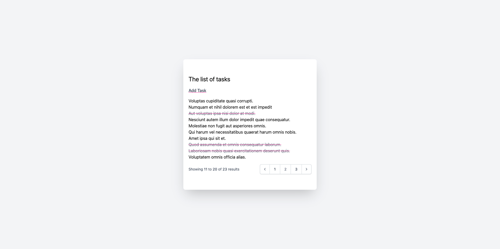
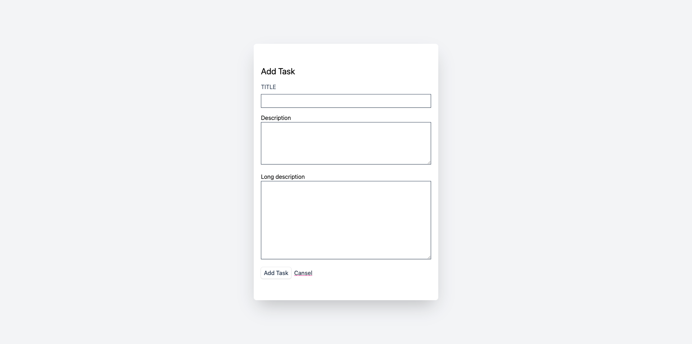
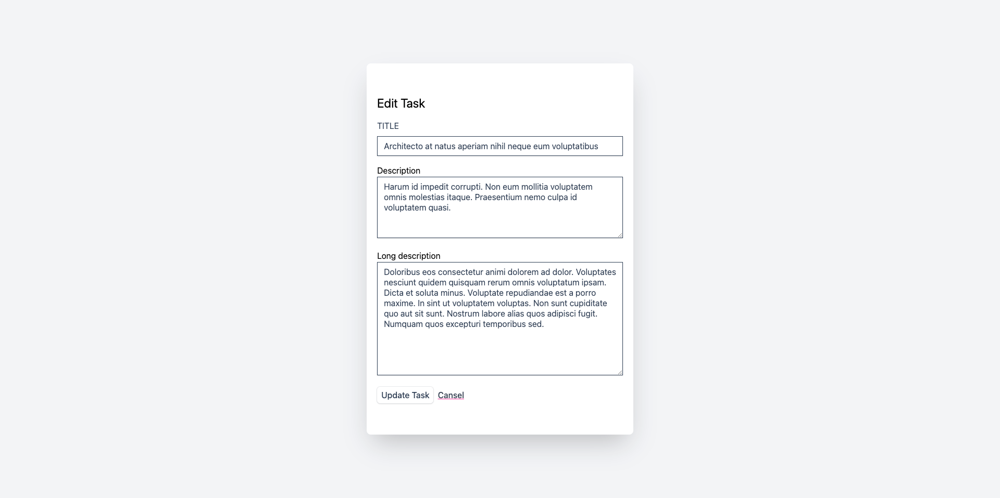
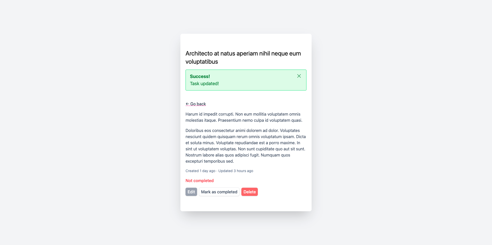

# Task List Application

This is a simple task list application built with Laravel as part of the "Laravel & PHP Mastery: Build 5 Real-World Projects" Udemy course.

## How to Run

1.  Clone the repository.
2.  Navigate to the project directory.
3.  Run `composer install` to install the dependencies.
4.  Create a `.env` file by copying `.env.example`.
5.  Run `php artisan key:generate`.
6.  Run `php artisan migrate` to create the necessary database tables.
7.  Run `php artisan serve` to start the development server.
8.  Open your browser and go to `http://127.0.0.1:8000`.

## Features

The application has the following features:

*   **View all tasks:** The main page displays a list of all tasks.
*   **Create a new task:** You can add a new task with a title, description, and long description.
*   **View a single task:** Clicking on a task will show its details.
*   **Edit a task:** You can edit the title, description, and long description of a task.
*   **Delete a task:** You can delete a task from the list.
*   **Mark a task as complete/incomplete:** You can toggle the completion status of a task.

## Application Pages

The application consists of the following pages:

*   **Index Page:** Displays the list of all tasks.
*   **Create Page:** A form to create a new task.
*   **Edit Page:** A form to edit an existing task.
*   **Show Page:** Displays the details of a specific task.

## Screenshots

Here are some screenshots of the application:

### Index Page

### Create Page

### Edit Page

### Show Page

