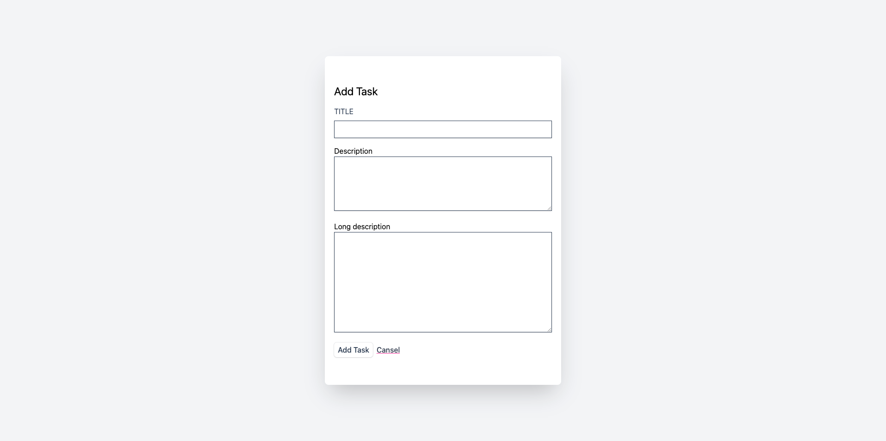
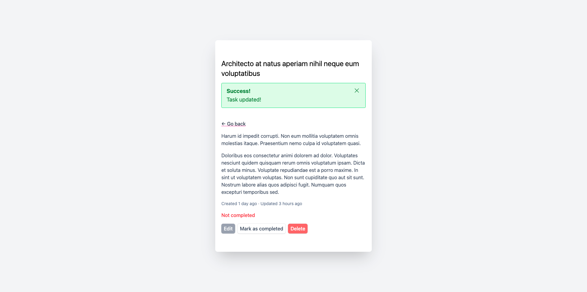

[English](./README.md) | [Русский](./README.ru.md)

# Приложение "Список задач"

Это простое приложение для ведения списка задач, созданное на Laravel в рамках курса Udemy "Laravel & PHP Mastery: Build 5 Real-World Projects".

## Как запустить

1.  Клонируйте репозиторий.
2.  Перейдите в директорию проекта.
3.  Выполните `composer install` для установки зависимостей.
4.  Создайте файл `.env`, скопировав `.env.example`.
5.  Выполните `php artisan key:generate`.
6.  Выполните `php artisan migrate` для создания таблиц в базе данных.
7.  Выполните `php artisan serve` для запуска сервера для разработки.
8.  Откройте браузер и перейдите по адресу `http://127.0.0.1:8000`.

## Функционал

Приложение обладает следующими возможностями:

*   **Просмотр всех задач:** На главной странице отображается список всех задач.
*   **Создание новой задачи:** Вы можете добавить новую задачу с заголовком, описанием и подробным описанием.
*   **Просмотр одной задачи:** Клик по задаче покажет её детали.
*   **Редактирование задачи:** Вы можете изменить заголовок, описание и подробное описание задачи.
*   **Удаление задачи:** Вы можете удалить задачу из списка.
*   **Отметить задачу как выполненную/невыполненную:** Вы можете переключать статус выполнения задачи.

## Страницы приложения

Приложение состоит из следующих страниц:

*   **Главная страница:** Отображает список всех задач.
*   **Страница создания:** Форма для создания новой задачи.
*   **Страница редактирования:** Форма для редактирования существующей задачи.
*   **Страница просмотра:** Отображает детали конкретной задачи.

## Скриншоты

Вот несколько скриншотов приложения:

### Главная страница

### Страница создания

### Страница редактирования

### Страница просмотра

